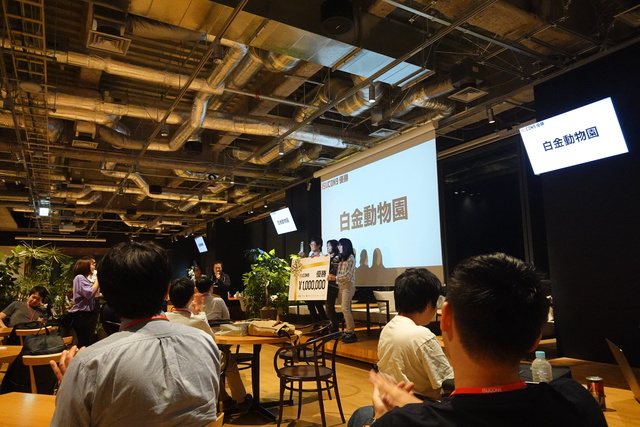

# ISUCON9で負けた話

A story of an ISUCON9 looser


株式会社ネットワーク応用通信研究所

前田　修吾

## ネットワーク応用通信研究所

* 業務内容
  * 受託開発、運用保守、教育
* Rubyの会社
* まつもとさんが（たまに）いる

## ISUCONとは

* Iikanjini Speed Up Contest
* お題となるWebサービスを決められたレギュレーションの中で
  限界まで高速化を図るチューニングバトル
* 18時にリリースしないといけないサービスを何とかするという設定
* 優勝賞金100万円

## 参加のきっかけ

* 社内Slackの#techにて
  * yhara: 興味ある人いませんか？
  * shugo, sada: :hand:

## 予選

* 予選はオンライン
* 会社から参加
* 598組中30組が本選進出

## 予選問題

* 椅子専用のフリマアプリISUCARI
* React.jsを使ったSPA
* 外部サービス（決済・配送）のAPI呼び出しもある

## 予選でやったこと

* N+1クエリの解消
* マスタをメモリ上にキャッシュ
* 配送サービスのAPI呼び出しの省略
* アプリケーションサーバとDBサーバの分離

## 予選通過！

* え、東京行かないといけないの？
* そうだ、出張にしよう！

## 本選


## 本選でやったこと

* Textbringerのインストール
* マスタをメモリ上にキャッシュ
* 空席情報の高速化
* 予約可能日数を366日に変更
* アプリケーションサーバとDBサーバの分離

## 空席情報（高速化前）

```ruby
def get_available_seats(train, from_station, to_station, seat_class, is_smoking_seat)
  # 指定種別の空き座席を返す

  # 全ての座席を取得する
  seat_list = db.xquery(
    'SELECT * FROM `seat_master` WHERE `train_class` = ? AND `seat_class` = ? AND `is_smoking_seat` = ?',
    train[:train_class],
    seat_class,
    is_smoking_seat,
  )

  available_seat_map = {}
  seat_list.each do |seat|
    key = "#{seat[:car_number]}_#{seat[:seat_row]}_#{seat[:seat_column]}"
    available_seat_map[key] = seat
  end

  query = <<__EOF
    SELECT
      `sr`.`reservation_id`,
      `sr`.`car_number`,
      `sr`.`seat_row`,
      `sr`.`seat_column`
    FROM
      `seat_reservations` `sr`,
      `reservations` `r`,
      `seat_master` `s`,
      `station_master` `std`,
      `station_master` `sta`
    WHERE
      `r`.`reservation_id` = `sr`.`reservation_id` AND
      `s`.`train_class` = `r`.`train_class` AND
      `s`.`car_number` = `sr`.`car_number` AND
      `s`.`seat_column` = `sr`.`seat_column` AND
      `s`.`seat_row` = `sr`.`seat_row` AND
      `std`.`name` = `r`.`departure` AND
      `sta`.`name` = `r`.`arrival`
__EOF

  if train[:is_nobori]
    query += 'AND ((`sta`.`id` < ? AND ? <= `std`.`id`) OR (`sta`.`id` < ? AND ? <= `std`.`id`) OR (? < `sta`.`id` AND `std`.`id` < ?))'
  else
    query += 'AND ((`std`.`id` <= ? AND ? < `sta`.`id`) OR (`std`.`id` <= ? AND ? < `sta`.`id`) OR (`sta`.`id` < ? AND ? < `std`.`id`))'
  end

  seat_reservation_list = db.xquery(
    query,
    from_station[:id],
    from_station[:id],
    to_station[:id],
    to_station[:id],
    from_station[:id],
    to_station[:id],
  )

  seat_reservation_list.each do |seat_reservation|
    key = "#{seat_reservation[:car_number]}_#{seat_reservation[:seat_row]}_#{seat_reservation[:seat_column]}"
    available_seat_map.delete(key)
  end

  available_seat_map.values
end
```

## 空席情報（高速化後）

```ruby
def get_available_seats(train, from_station, to_station, seat_class, is_smoking_seat)
  # 指定種別の空き座席を返す

  # 全ての座席件数を取得する
  max_seat_count = seat_counts[[train[:train_class], seat_class, is_smoking_seat]] || 0

  query = <<__EOF
    SELECT
      COUNT(`sr`.`reservation_id`) AS seat_count
    FROM
      `seat_reservations` `sr`,
      `reservations` `r`,
      `seat_master` `s`,
      `station_master` `std`,
      `station_master` `sta`
    WHERE
      `r`.`date` = ? AND
      `r`.`reservation_id` = `sr`.`reservation_id` AND
      `s`.`seat_class` = ? AND
      `s`.`is_smoking_seat` = ? AND
      `s`.`train_class` = `r`.`train_class` AND
      `s`.`car_number` = `sr`.`car_number` AND
      `s`.`seat_column` = `sr`.`seat_column` AND
      `s`.`seat_row` = `sr`.`seat_row` AND
      `std`.`name` = `r`.`departure` AND
      `sta`.`name` = `r`.`arrival`
__EOF

  if train[:is_nobori]
    query += 'AND ((`sta`.`id` < ? AND ? <= `std`.`id`) OR (`sta`.`id` < ? AND ? <= `std`.`id`) OR (? < `sta`.`id` AND `std`.`id` < ?))'
  else
    query += 'AND ((`std`.`id` <= ? AND ? < `sta`.`id`) OR (`std`.`id` <= ? AND ? < `sta`.`id`) OR (`sta`.`id` < ? AND ? < `std`.`id`))'
  end

  reserved_seat_count = db.xquery(
    query,
    train[:date],
    seat_class,
    is_smoking_seat,
    from_station[:id],
    from_station[:id],
    to_station[:id],
    to_station[:id],
    from_station[:id],
    to_station[:id],
  ).first[:seat_count]

  max_seat_count - reserved_seat_count
end
```

## 結果: 13位


## 優勝チーム



## 敗因

* Textbringerのインストールに手こずった
* 準備・練習をしていなかった
* 手が遅かった
* アプリケーションの動作を変えないようにし過ぎた

## 白金動物園のコード

```ruby
def get_available_seats(train, from_station, to_station, seat_class, is_smoking_seat)
  # 指定種別の空き座席を返す
  key = "isutrain:#{train[:train_class]}/#{train[:is_nobori]}/#{seat_class}/#{is_smoking_seat}/#{from_station[:id]}/#{to_station[:id]}"
  cache = redis.get(key)
  return cache.to_i if cache

  puts key

  # 全ての座席を取得する
  seat_list = SEAT_MASTER_BY_CLASS["#{train[:train_class]}\0#{seat_class}\0#{is_smoking_seat}"] || []
  available_seat_map = {}
  seat_list.each do |seat|
    key = "#{seat[:car_number]}_#{seat[:seat_row]}_#{seat[:seat_column]}"
    available_seat_map[key] = seat
  end

  query = <<__EOF
    SELECT
      `sr`.`reservation_id`,
      `sr`.`car_number`,
      `sr`.`seat_row`,
      `sr`.`seat_column`
    FROM
      `seat_reservations` `sr`,
      `reservations` `r`
    WHERE
      `r`.`reservation_id` = `sr`.`reservation_id`
__EOF

  if train[:is_nobori]
    query = "#{query} AND (`r`.`arrival_id` < ? AND ? <= `r`.`departure_id`)\nUNION #{query} AND (`r`.`arrival_id` < ? AND ? <= `r`.`departure_id`)\nUNION #{query} AND (? < `r`.`arrival_id` AND `r`.`departure_id` < ?)"
  else
    query = "#{query} AND (`r`.`departure_id` <= ? AND ? < `r`.`arrival_id`)\nUNION #{query} AND (`r`.`departure_id` <= ? AND ? < `r`.`arrival_id`)\nUNION #{query} AND (`r`.`arrival_id` < ? AND ? < `r`.`departure_id`)"
  end

  seat_reservation_list = db.xquery(
    query,
    from_station[:id],
    from_station[:id],
    to_station[:id],
    to_station[:id],
    from_station[:id],
    to_station[:id],
  )

  seat_reservation_list.each do |seat_reservation|
    key = "#{seat_reservation[:car_number]}_#{seat_reservation[:seat_row]}_#{seat_reservation[:seat_column]}"
    available_seat_map.delete(key)
  end

  count = available_seat_map.values.length
  # 30秒もキャッシュしている！
  redis.psetex(key, AVAILABLE_SEATS_CACHE_TIME, count.to_s)
  count
end
```

## ISUCON10で勝たせてくれる人募集

* https://www.netlab.jp/recruit/

## ご清聴ありがとうございました


